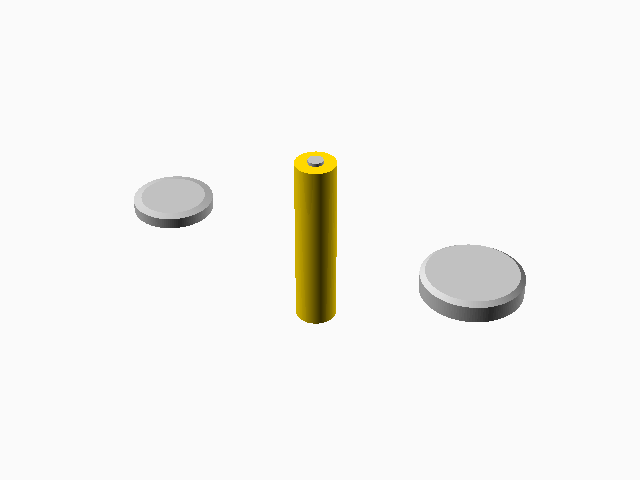
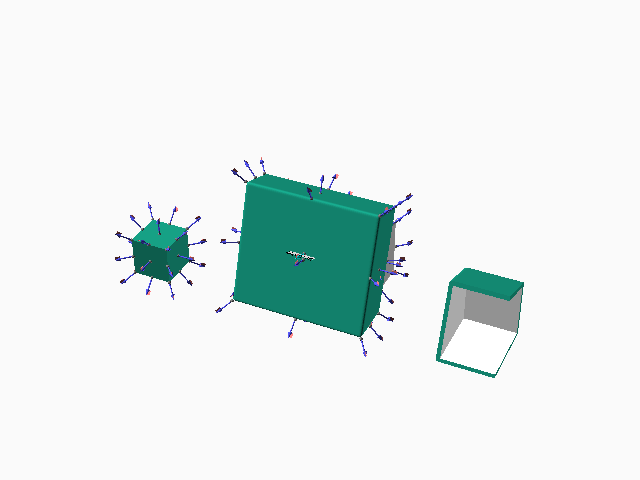
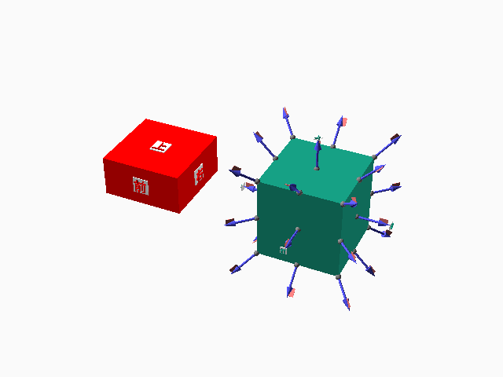
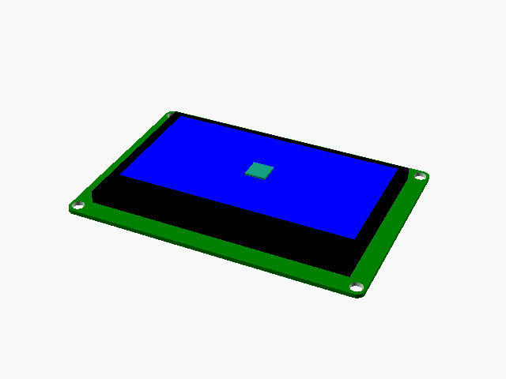
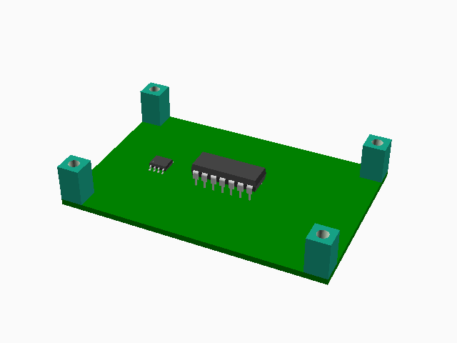
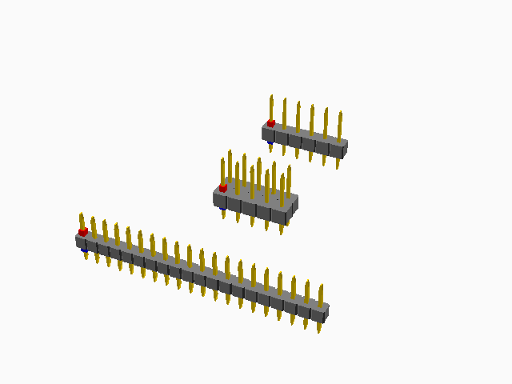
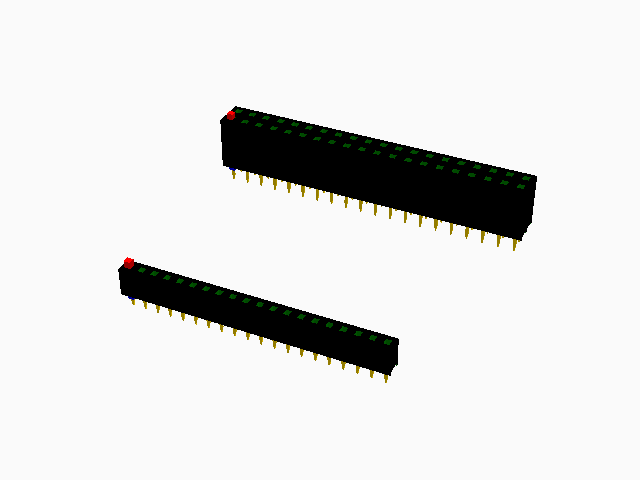
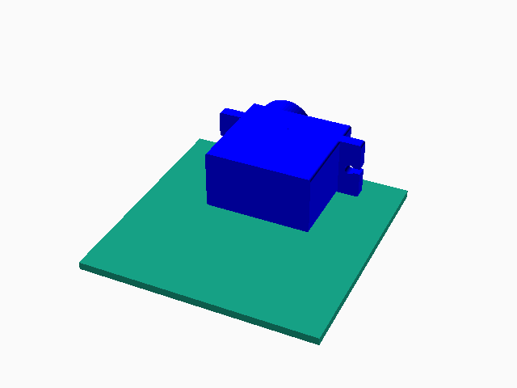
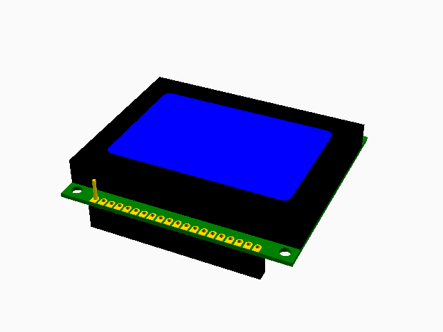
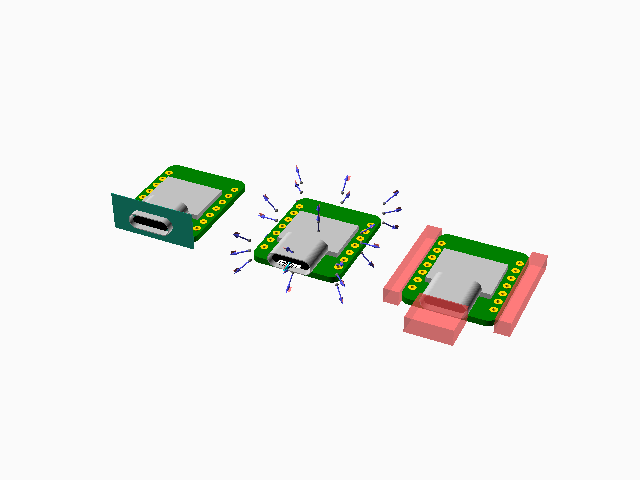

#+TITLE: coaji --- A Small OpenSCAD library
#+AUTHOR: Yoshinari Nomura
#+EMAIL: nom@quickhack.net
#+DATE: 2026-01-01
#+OPTIONS: H:3 num:nil toc:nil
#+OPTIONS: ^:nil \n:nil ::t |:t f:t tex:t
#+OPTIONS: d:nil tags:t
#+OPTIONS: author:t email:nil creator:nil
#+OPTIONS: timestamp:nil timestamps:nil
#+STARTUP: indent show3levels
#+PROPERTY: header-args:scad :tangle yes :comments org :exports code :results file :colorscheme Tomorrow :size 200,200
#+LANGUAGE: en

* What is coaji?
coaji: is a small OpenSCAD library,
named after small horse mackerel (scad) in Japanese.

* Usage
Requires [[https://github.com/BelfrySCAD/BOSL2/][BOSL2]]

#+begin_src scad
  include <coaji/std.scad>
#+end_src

* Examples
battery.scad
#+begin_src scad
  include <coaji/std.scad>
  $fn = 128;
  left(40) cr2032();
  battery_aaa();
  right(40) cr2450();
#+end_src

canted_box.scad
#+begin_src scad
  include <coaji/std.scad>
  // Create canted box and hollow it out by opening the front.
  right(100) left_half() diff()
    canted_box(size=B_SIZE, angles=[90-TILT, 90, 0, 90], rounding=2)
      attach(BACK, BACK, inside=true, overlap=-2)
        color("white") tag("remove")
          canted_box(size=B_SIZE-[4, 0, 0],
                     angles=[90-TILT, 90, 0, 90],
                     deltas=[2, -2, -2, -2]);
  // Standard cuboid for the reference
  left(80) cuboid(20, anchor=FRONT+BOTTOM) show_anchors();
#+end_src

develop.scad
#+begin_src scad
  include <coaji/std.scad>
  left(10) recolor("red") cuboid([10, 10, 5])
    show_faces(fg="red");

  right(10) cuboid(10)
    show_anchors(4)
      show_faces(4, overlap=-4);
#+end_src

oled12864.scad
#+begin_src scad
  include <coaji/std.scad>
  $fn = 64;
  oled12864()
    attach_part("SCREEN")
      attach(TOP, BOTTOM)
        cuboid([5, 5, 0.5]);
#+end_src

parts-box.scad
#+begin_src scad
  include <coaji/std.scad>
  // Akizuki universal PCB type-C + 10mm spacer
  pcb([72, 47.5, 1.6], mh_d=3, mh_inset=3)
    attach(TOP,BOTTOM, align=CORNERS) spacer([6,6,10], d=3);

  up(5) dip(14);
  up(1.8) left(20) sop(8);
#+end_src

pinheader.scad
#+begin_src scad
  include <coaji/std.scad>
  // + pin header 1x6 (6P) pitch=2.54mm
  //   https://akizukidenshi.com/catalog/g/g100167/
  //   (datasheet: https://akizukidenshi.com/goodsaffix/PH-1xXXSG-AD.pdf)
  pinheader(size=[15.24, 2.5, 2.5], n=6, pl=3, pl2=6.1, pitch=2.54) {
    attach("P1-TOP", BOTTOM) color("red") cuboid(1);
    attach("P1-BOT", TOP) color("blue") cuboid(1);
  }

  // + pin header 2x5 (10P) pitch=2.54mm
  fwd(20) pinheader(size=[12.7, 5.08, 2.5], n=[5, 2], pl=3, pl2=6.1, pitch=2.54) {
    attach("P1-TOP", BOTTOM) color("red") cuboid(1);
    attach("P1-BOT", TOP) color("blue") cuboid(1);
  }

  // + pin header 1x20 pitch=2mm
  //   https://akizukidenshi.com/catalog/g/g103667/
  //   (datasheet: https://akizukidenshi.com/goodsaffix/PH2-1xXXSBG.pdf)
  fwd(40) pinheader(size=[40, 2, 2], n=20, pl=2.8, pl2=3.9, pitch=2) {
    attach("P1-TOP", BOTTOM) color("red") cuboid(1);
    attach("P1-BOT", TOP) color("blue") cuboid(1);
  }
#+end_src

pinsocket.scad
#+begin_src scad
  include <coaji/std.scad>
  // + Pin socket 2x20(40P) 2.54mm pitch
  //   https://akizukidenshi.com/catalog/g/g100085/
  pinsocket(size=[51.05, 5, 8.5], n=[20, 2], pl=3) {
    attach("P1-TOP", BOTTOM) color("red") cuboid(1);
    attach("P1-BOT", TOP) color("blue") cuboid(1);
  }

  // + Pin socket 1x20(20P) 2mm pitch
  //   https://akizukidenshi.com/catalog/g/g103871/
  fwd(40) pinsocket(size=[40.5, 2.4, 4.3], n=20, pitch=2, pl=2.4) {
    attach("P1-TOP", BOTTOM) color("red") cuboid(1);
    attach("P1-BOT", TOP) color("blue") cuboid(1);
  }
#+end_src

sg90.scad
#+begin_src scad
  include <coaji/std.scad>
  $fn = 64;
  cuboid([50, 50, 1.6]) attach(TOP,FRONT, align=BACK) sg90();
#+end_src

tg12864e.scad
#+begin_src scad
  include <coaji/std.scad>
  // + 2mm pitch pin-socket 1x20 (20P) H=4.3
  //   https://akizukidenshi.com/catalog/g/g103871/
  // + 2mm pitch pin-header 1x20 (20P) H=2.0
  //   https://akizukidenshi.com/catalog/g/g103867/
  //
  PCB_CONNECTOR_SIZE = [40.5, 2.4, 4.3+2.0];

  tg12864e() {
    attach_part("PCB")
      attach(BOTTOM, BOTTOM, align=FRONT, inset=0.3)
        color("black") cuboid(PCB_CONNECTOR_SIZE);
    color("gold") attach("P1-TOP", BOTTOM) cuboid([0.6, 0.6, 5]);
  }
#+end_src

xiao.scad
#+begin_src scad
  include <coaji/std.scad>
  $fn = 64;
  left(30) xiao()
    attach("USB-I", TOP)
      cuboid([$pcb_size.x, 8, 0.1]);

  xiao() show_anchors(4, std=true, custom=true);

  right(30) xiao() {
    #attach_part("PCB") {
      attach([LEFT,RIGHT], RIGHT, spin=90) cuboid([3, 3, $pcb_size.y]);
    }
    #attach_part("USB") {
      attach(FRONT, FRONT) cuboid($usb_size);
    }
  }
#+end_src

